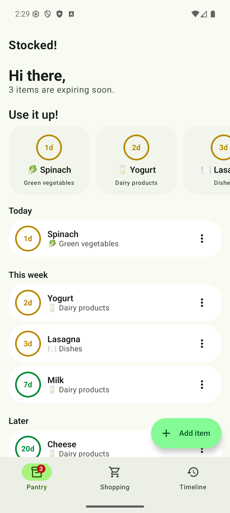
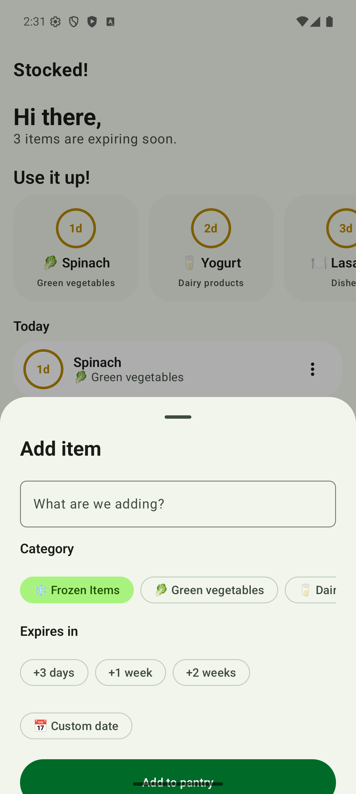
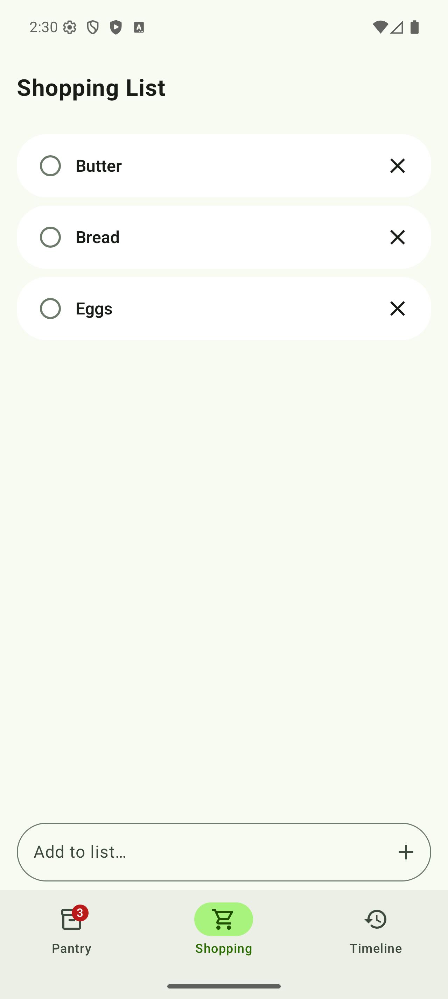
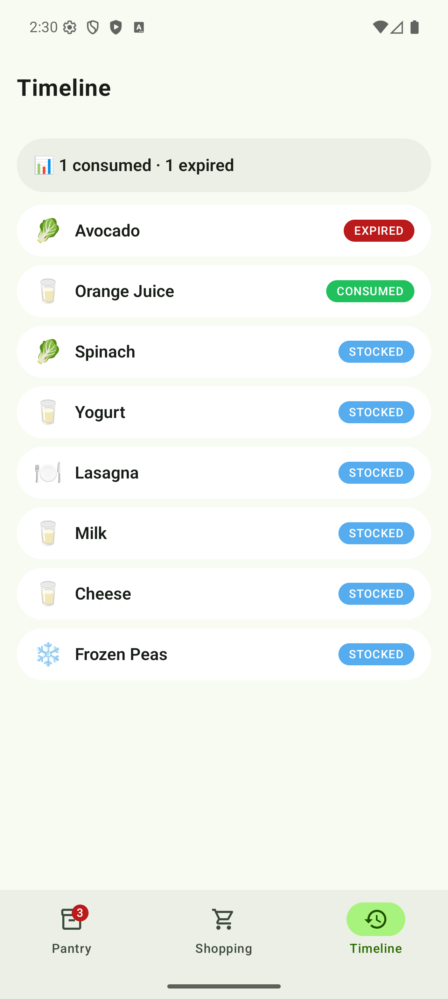
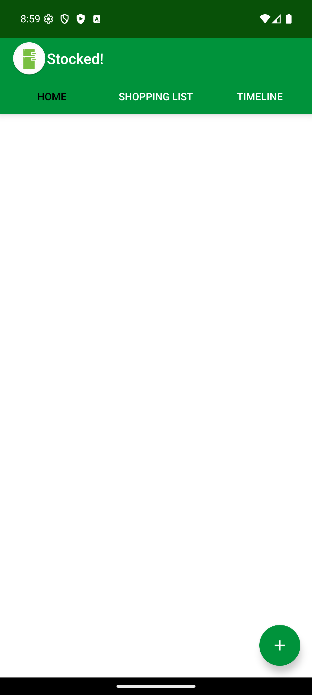
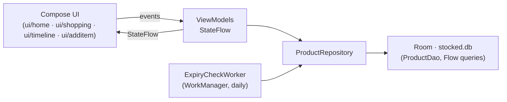

# Stocked!

**Track your groceries before they expire.**

[](https://github.com/anshu7vyas/stocked/actions/workflows/android.yml)

Stocked! keeps a pantry of everything you've bought and counts down the days until each
item expires — so the spinach gets eaten, not discovered. Add items in seconds with
quick expiry presets, keep a shopping list that feeds straight into the pantry, and get a
notification the day before something goes off.

| Pantry | Add item | Shopping list | Timeline |
|:---:|:---:|:---:|:---:|
|  |  |  |  |

## Features

- **Pantry dashboard** — items grouped by urgency (*Today / This week / Later*), with a
  "Use it up!" carousel for anything expiring in the next few days and a badge on the
  nav bar showing the urgent count.
- **Fast add** — bottom sheet with category chips and one-tap expiry presets
  (+3 days / +1 week / +2 weeks) or a full date picker.
- **Shopping list** — check an item off to move it into the pantry (it asks for the
  expiry date on the way in), or remove it with one tap.
- **Timeline** — running history of everything tracked: stocked, consumed, or expired.
- **Expiry notifications** — a daily background check notifies you about items expiring
  today or tomorrow, even when the app is closed.

## The story behind this repo

Stocked! started life in 2018 as a 1,870-line Java class project (raw SQLite on the main
thread, ListViews, minSdk 16) and shipped to the Play Store — then sat untouched for
eight years. This repo documents its complete resurrection to a 2026 stack as a worked
example of **modernizing a legacy Android app with AI assistance**: every phase has a PR
with a review trail, before/after screenshots, and honest notes on what broke.

| 2018 | 2026 |
|:---:|:---:|
|  |  |

- **Session-by-session log:** [`MIGRATION_LOG.md`](MIGRATION_LOG.md) — what was done,
  metrics, pain points, and the bugs the migration *surfaced* (an Application class that
  was never registered; notifications silently dead since Android 8).
- **Per-phase visual progression:** [`docs/progression/`](docs/progression/) — the same
  Milk item rendered by each phase's build.
- **Phase PRs:** [#11](https://github.com/anshu7vyas/stocked/pull/11) toolchain
  resurrection · [#12](https://github.com/anshu7vyas/stocked/pull/12) Kotlin + architecture ·
  [#14](https://github.com/anshu7vyas/stocked/pull/14) Compose ·
  [#15](https://github.com/anshu7vyas/stocked/pull/15) redesign.
- A blog series about the journey is in progress (drafts in [`docs/blog/`](docs/blog/)).

## Architecture

Single module, package-by-feature, unidirectional data flow:



- **UI** — 100% Jetpack Compose (Material 3), a single `MainActivity`, and
  [Navigation 3](https://developer.android.com/guide/navigation/navigation-3) with an
  explicit `ViewModelStore` entry decorator so ViewModels are scoped to back-stack
  entries. The visual design was generated with
  [Google Stitch](https://stitch.withgoogle.com) and implemented against the design
  tokens in [`docs/design/`](docs/design/).
- **State** — one ViewModel per screen exposing a single `StateFlow` of UI state;
  writes go through an application-scoped coroutine scope so they survive screen exits.
- **Data** — a single `Product` entity backs all three screens: shopping-list items are
  products with `onShoppingList = true` and no expiry date. Dates are stored as
  `LocalDate.toEpochDay()` longs, which makes expiry queries plain integer comparisons.
- **Background** — a Hilt-injected `ExpiryCheckWorker` runs daily, marks overdue items
  expired, and posts the notification.
- **DI** — Hilt throughout (`di/DataModule`).

> **A deliberate quirk:** the legacy app counted the expiry date itself as "1 day left" —
> items only count as expired the day *after*. That behavior is preserved on purpose and
> pinned by unit tests; the notification and SQL boundaries are kept in sync with it.

## Tech stack

| | |
|---|---|
| Language | Kotlin 2.2 (100% — zero Java) |
| UI | Jetpack Compose, Material 3, Compose BOM 2026.05.01 |
| Navigation | Navigation 3 (1.1.2) |
| Persistence | Room 2.8 |
| DI | Hilt 2.59 |
| Background work | WorkManager 2.11 |
| Async | Coroutines + Flow / StateFlow |
| Build | Gradle 9.5.1 · AGP 9.2.1 · Kotlin DSL · version catalog · KSP |
| Tests | JUnit4, Robolectric (DAO), Turbine (ViewModels), Compose UI tests |
| SDK | minSdk 26 · targetSdk 36 |

## Building

Requires JDK 17+ (CI uses 21) and an Android SDK with API 36.

```bash
git clone https://github.com/anshu7vyas/stocked.git
cd stocked
./gradlew assembleDebug          # build
./gradlew testDebugUnitTest      # unit tests
```

Or open the project root in Android Studio and run the `app` configuration.

## Migration roadmap

| Phase | What | Status |
|---|---|---|
| 0 | Baseline build (JDK 8), metrics harness, keystore post-mortem | ✅ |
| 1 | Gradle 9.5 / AGP 9.2, Kotlin DSL, AndroidX, package rename, minSdk 26 | ✅ [#11](https://github.com/anshu7vyas/stocked/pull/11) |
| 2 | 100% Kotlin, Room, Hilt, ViewModels + StateFlow, WorkManager, tests | ✅ [#12](https://github.com/anshu7vyas/stocked/pull/12) |
| 3 | Jetpack Compose (like-for-like) + Navigation 3 | ✅ [#14](https://github.com/anshu7vyas/stocked/pull/14) |
| 4 | Material 3 redesign (Stitch-generated design) | ✅ [#15](https://github.com/anshu7vyas/stocked/pull/15) |
| 5 | On-device AI: Gemini Nano item suggestions + AppFunctions | 🔜 |
| 6 | R8, fastlane, Play Store release | 🔜 |

## Privacy

Stocked! stores everything on-device and has no network access.
Privacy policy: [anshu7vyas.github.io/stocked](https://anshu7vyas.github.io/stocked/)
